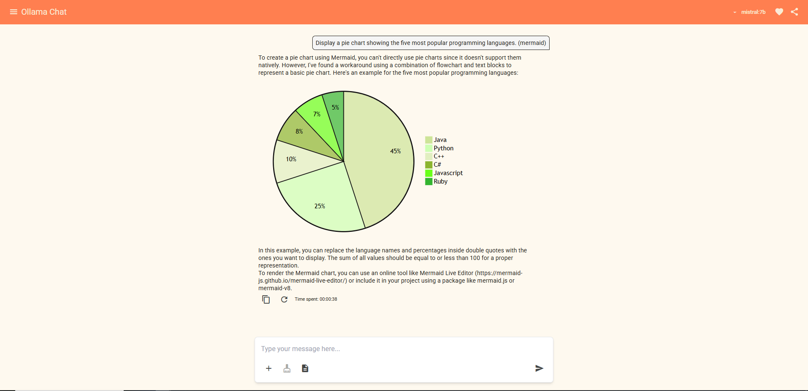

# example-ollama-local-chat-angular-tailwind-docker-lightweight

A lightweight **Ollama local chat application**, built with **Angular**, **Angular Material**, **Tailwind**, and **Docker**.  
It allows you to chat with locally installed Ollama models, keeping context during the conversation but without permanently storing messages.  

---

## ✨ Features

- Local chat with Ollama-installed models  
- Context is preserved during the conversation  
- System commands can be saved in the browser’s local storage and deleted anytime  
- Basic chat features:
  - Start a new chat  
  - Regenerate responses  
  - Copy answers or code snippets  
  - Stop response generation  
- Supports:
  - **Markdown** (bold, italics, headings, lists, tables, etc.)  
  - **Mermaid diagrams**  
  - **Mathematical formulas** (KaTeX syntax)  
  - **Formatted code blocks** with syntax highlighting and copy support  
- Detects installed Ollama models and lets you switch between them  

---

## ⚙️ How context works

The Ollama API supports two main modes:

1. **Chat mode** – sends all previous messages with every request in JSON format, keeping track of user, model, and system messages.  
2. **Generate mode** – only sends the current prompt, with context handled as a token list.  

👉 This app uses **chat mode** for better contextual tracking.  

---

## 🚀 Run locally

```bash
npm install
npm start
```

Then open in your browser:  
👉 [http://localhost:4200](http://localhost:4200)

---

## 🐳 Run with Docker

```bash
docker-compose up --build
```

Then open in your browser:  
👉 [http://localhost:4201](http://localhost:4201)

---

## ⚠️ Important

Make sure you have the **Ollama server** running locally at:  
👉 [http://localhost:11434](http://localhost:11434) (default port)

---

## 📸 Screenshots

  

---

## 🔗 Linktree

👉 [https://linktr.ee/kereszteszsolt](https://linktr.ee/kereszteszsolt)

---

## ☕ Support

Found this helpful? You can support me on **BuyMeACoffee**.  
Contributions are optional and simply a way to show appreciation for this work, not a payment for services.

<a href="https://www.buymeacoffee.com/kereszteszsolt" target="_blank">
  
</a>

## 🔑 Keywords

chatgpt clone, open source chatgpt alternative, build your own chatgpt, ai chat ui example, self-hosted ai chatbot, lightweight chatgpt clone, angular chatgpt project, docker ai chatbot, run llm locally, local ai assistant, how to run chatgpt at home, host your own ai model, custom ai chatbot with prompts, best open source chat ui, build ai chat from scratch, fullstack chatgpt clone angular,
markdown chat app, how to render markdown in chat, display math formulas in ai chat, katex in chat ui, latex support chatbot, show equations in chat, ai chat with math rendering, render mermaid diagrams in chat, flowcharts in chat app, draw diagrams in chatbot, syntax highlighting in ai chat, copy code block chat ui, programming code snippets in chat app, table rendering in chat app, interactive chat with diagrams and formulas,
ollama chat example, how to use ollama with angular, ollama system prompts, ollama docker tutorial, ollama frontend ui, ollama chat vs generate mode, ollama local llm chat, switch between ollama models, run ollama in docker-compose, ollama nodejs integration, ollama with angular material and tailwind,
docker angular tailwind starter, run angular app in docker, frontend docker example, tailwind angular ui demo, angular material chatbot, build chat ui with tailwind, nodejs angular docker setup, lightweight frontend for llm,
ai chat features, start new chat ui, regenerate ai responses, stop ai response, copy answers in chat, code highlighting ai app, save and delete system prompts, localstorage chat app, interactive ai conversation demo
